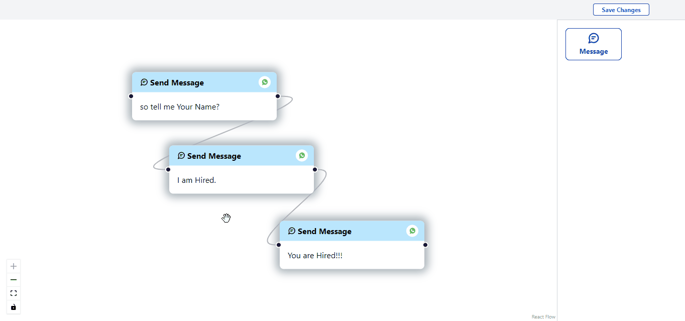

# Chatbot Flow Builder  💬

Welcome to Chatbot Flow Builder, where creating conversational flow diagrams for your chatbots is as easy as sending a message! With this tool, you can effortlessly visualize the flow of conversations between text nodes, helping you craft the perfect chatbot interactions. Let's dive in and make your chatbot dreams a reality! 🎉

## Try it Out! 🚀

Chatbot Flow Builder is live and ready for you to use! Visit the website [here](#) and start building your chatbot flows today!

## Screenshots 📸

Check out Chatbot Flow Builder in action:

## Features 🚀

- **Easy Peasy Interface**: This web app comes with a user-friendly interface that's as smooth as butter. Building and editing chatbot flow diagrams has never been easier!
- **Text Nodes Galore**: Add, and connect text nodes to your heart's content. Constructing the conversational flow of your chatbot is a breeze!
- **Drag-and-Drop Magic**: Rearrange text nodes effortlessly with our drag-and-drop functionality. It's like moving pieces on a chessboard, but way cooler!

## Web Technologies Used 🛠️

- **TypeScript**: TypeScript adds some extra spice to JavaScript by providing type-checking capabilities. Say goodbye to those pesky runtime errors!
- **React**: React is the bread and butter of building user interfaces. With its reusable UI components, creating complex web applications is a piece of cake!
- **Tailwind CSS**: Tailwind CSS is like having a magical wand for styling. Say hello to rapid UI development without breaking a sweat!

## Join the Fun 🎉

Feeling inspired? We'd love to have you join us on this journey! While we're not accepting contributions at the moment, your feedback and suggestions are always welcome.

## Give a Star ⭐

If you find Chatbot Flow Builder exciting and useful, why not show your appreciation by giving it a star on GitHub? Your support means the world to us and helps spread the word about Chatbot Flow Builder's awesomeness!
